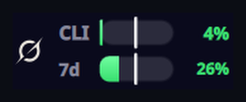
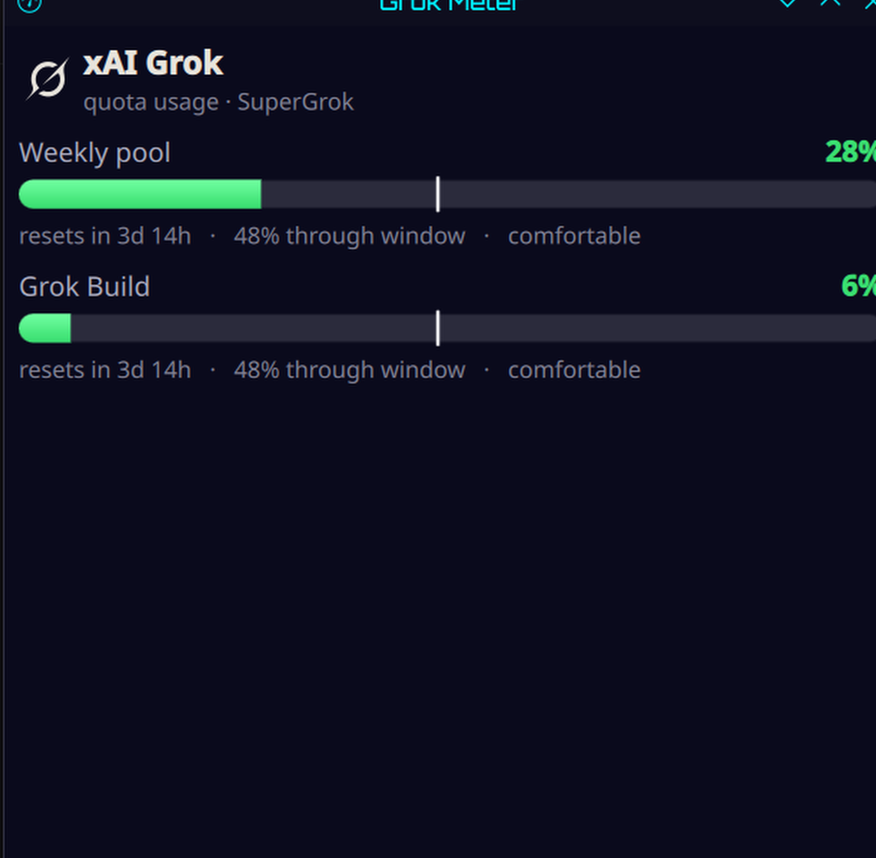

# Grok Meter

> [!NOTE]
> **There's now one widget for all of them.** [AI Meter](https://github.com/matpb/ai-meter) shows Claude (any number of accounts), Codex, Grok and Cursor in a single KDE Plasma widget, with an optional Android home screen widget. New work happens there. This widget keeps working, and its reader script lives on inside AI Meter.

A KDE Plasma panel widget that shows your **live SuperGrok usage** as two compact bars, colored by
how you're tracking against the clock.



xAI meters a **unified weekly pool** across Chat, Imagine, Voice, and Build. There is no 5-hour
window. The bars are:

- **7d** — the account-wide weekly SuperGrok pool (`creditUsagePercent`)
- **CLI** — Grok Build's share of that same week (`productUsage` / `GrokBuild`)

It reads your usage from the same billing endpoint the Grok CLI uses, with the token `grok login`
already put on your disk. No browser, no cookies, no keyring. Always fresh, counts usage from
**every SuperGrok surface**, and costs **zero quota** — it's a read-only status check, not a prompt.

---

## Who this is for

- You're on **KDE Plasma 6** (the widget is a Plasma applet). It is *KDE-only* — it won't work on
  GNOME, Xfce, etc.
- You use the **Grok Build CLI** and you've run `grok login`.
- You're on a **SuperGrok / Grok Pro** subscription. Pay-as-you-go API keys have no weekly pool to
  show.

## What the bars tell you



Each bar packs four signals:

| Element | Meaning |
|---|---|
| **Fill length** | How much of that window's quota you've used (`22%`). |
| **Vertical tick** | How far *through the week by time* you are. Fill **left** of the tick = you're under pace; fill **right** of it = burning fast. Both bars share the same weekly clock: CLI is a slice of the pool, not a separate window. |
| **Color** | Pace, not raw usage: **green** = comfortably under, **yellow** = right on the clock, **red** = ahead of the clock. So 90% used with 95% of the week elapsed still reads calm; 40% used on day one reads hot. |
| **↺ marker** | The week just reset — the live number may still be catching up. |

A window nobody has touched yet reads **"unused"** rather than `0%`, so you can tell a fresh week
from a frugal one. If the week is underway but Grok Build hasn't been used, CLI reads unused too.

Hover for exact numbers, reset countdowns and pace; click to open the detail popup.

When the reading is not live, the panel shows a **disconnected-plug badge reading “offline”** — the
live billing fetch failed and the bars are coming from the last successful live read on disk. If
that fallback also goes stale (older than ten minutes) the bars dim and the badge switches to a
clock with the reading's age. Hover for the reason and the fix.

This matters because a fresh cache is otherwise indistinguishable from a live reading. The badge is
what makes the degradation visible.

## Requirements

- KDE Plasma **6**
- The **Grok CLI** logged in (`grok login`) — credentials live at `~/.grok/auth.json`
- A SuperGrok / Grok Pro subscription
- CLI tools: `jq`, `curl`, `kpackagetool6`

```bash
# Fedora KDE
sudo dnf install jq curl kf6-kpackage
# Arch
sudo pacman -S jq curl
# openSUSE
sudo zypper install jq curl
```

## Install

```bash
git clone https://github.com/matpb/grok-meter.git
cd grok-meter
./install.sh
```

The installer registers the plasmoid and offers to drop it straight into your top panel. If you'd
rather add it by hand: right-click your panel → **Add Widgets…** → search **Grok Meter**.

No configuration needed.

## How it works

1. Every ~90 seconds the widget runs its bundled reader (`contents/scripts/grok-meter.sh`).
2. The reader takes the access token out of `~/.grok/auth.json` — the file `grok login` writes — and
   checks the token's `exp` before spending a round-trip on it.
3. It calls `https://cli-chat-proxy.grok.com/v1/billing?format=credits` (the same billing the CLI
   itself reads) and turns the weekly pool and the Grok Build product share into the bars.
4. If the token has expired or the network is down, it falls back to the last successful live read
   cached at `~/.config/grok-meter/last.json`. The widget then shows how old that reading is, with
   the degraded badge.

The token is used **only in memory**, sent **only to cli-chat-proxy.grok.com over HTTPS**, and is
**never logged**, never written. Nothing else is stored except the usage snapshot (percents and
reset times, no credentials).

### About the token

The Grok CLI refreshes the token whenever it runs, so in normal daily use it never goes stale. Go
long enough without opening Grok and the live fetch stops; the widget quietly falls back to the last
cache, and one `grok` run puts it back. Grok Meter deliberately does **not** refresh the token
itself — writing to `auth.json` would race with the CLI, which owns that file.

## Configuration (all optional)

| Variable | Purpose |
|---|---|
| `GROK_HOME` | Grok config directory (default `~/.grok`). |
| `GROK_METER_CACHE` | Snapshot path (default `~/.config/grok-meter/last.json`). |
| `GROK_METER_DEBUG=1` | Print diagnostics to stderr — run the reader by hand to see why the live fetch fails. Never logs the token. |

## Bonus: a matching Grok status line

Grok's pager can run a command as its status-line row. Point it at `extras/statusline.sh`:

```toml
[ui.status_line]
type = "command"
command = "~/path/to/grok-meter/extras/statusline.sh"
refresh_interval = 90
```

which renders as:

```
Grok 7d 22% · CLI 1%
```

Grok reads `[ui.status_line]` at startup, so restart the CLI after editing `~/.grok/config.toml`.

## Options

Right-click the widget → **Configure Grok Meter…** → **Appearance**:

| Option | Default | What it does |
|---|---|---|
| **Show the Grok icon** | on | Puts the Grok mark in front of the bars. Handy when you run this next to the sibling widgets and want to tell them apart at a glance. |
| **Tint it to match the panel** | off | Renders the mark in your panel's text colour instead of the brand colour. |
| **Show the "CLI" and "7d" labels** | on | Turn off to reclaim panel width once the icon makes it obvious which widget is which. |

## Uninstall

```bash
./uninstall.sh
```

Then right-click the widget in your panel → **Remove**.

## Troubleshooting

Run the reader by hand with diagnostics:

```bash
GROK_METER_DEBUG=1 ~/.local/share/plasma/plasmoids/org.mat.grokmeter/contents/scripts/grok-meter.sh
```

- **`no ~/.grok/auth.json`** — run `grok login`.
- **`access token expired`** — run `grok` once; the CLI refreshes the token on startup.
- **Bars are dimmed with a clock, or an offline badge** — the live fetch failed and it's showing
  your last cached numbers.
- **Nothing updates** — restart the shell: `kquitapp6 plasmashell && kstart plasmashell`.

## See also

[**Claude Meter**](https://github.com/matpb/claude-meter) and
[**Codex Meter**](https://github.com/matpb/codex-meter) — the same widget for Claude and Codex
usage. The three are fully independent; run any combination.

## Disclaimer

This is an **unofficial** tool and is not affiliated with or endorsed by xAI / SpaceXAI. It reads a
CLI billing endpoint using your own credentials, which could change at any time. Use it for your
own account only.

## Icon

The bundled Grok swirl is used only to label which service the bars are reporting on. The trademark
belongs to xAI; this project is unaffiliated.

## License

MIT — see [LICENSE](LICENSE). Copyright © 2026 [Mathieu-Philippe Bourgeois](https://matpb.com).
